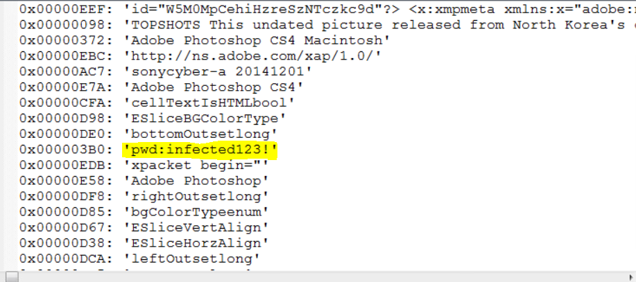
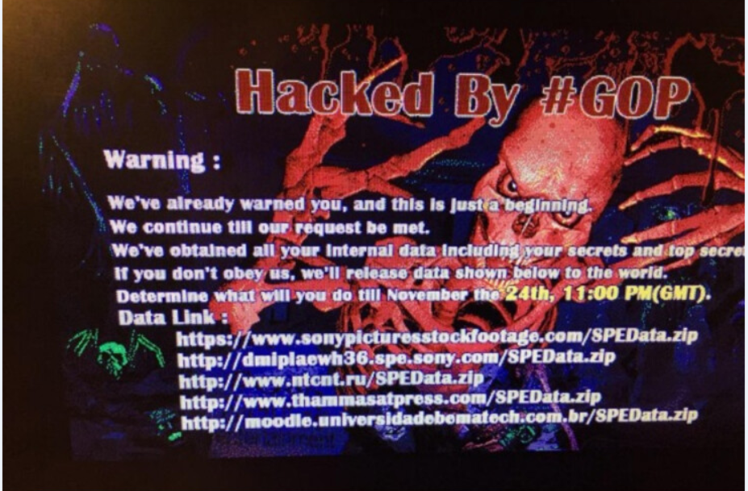
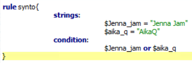
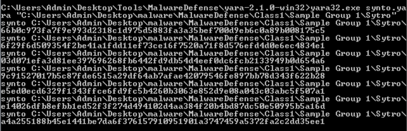
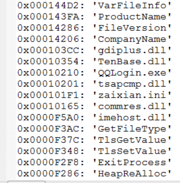
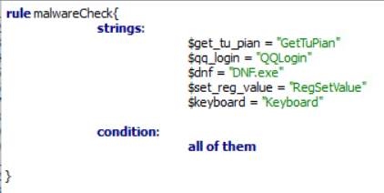
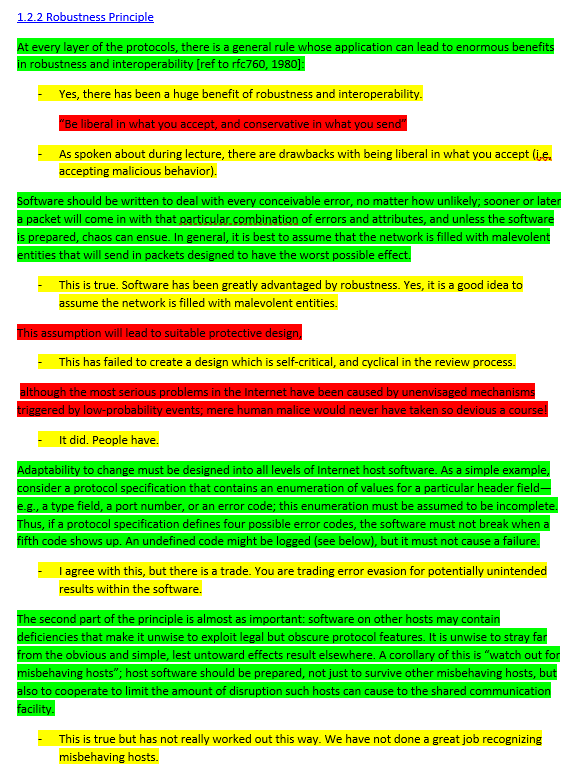
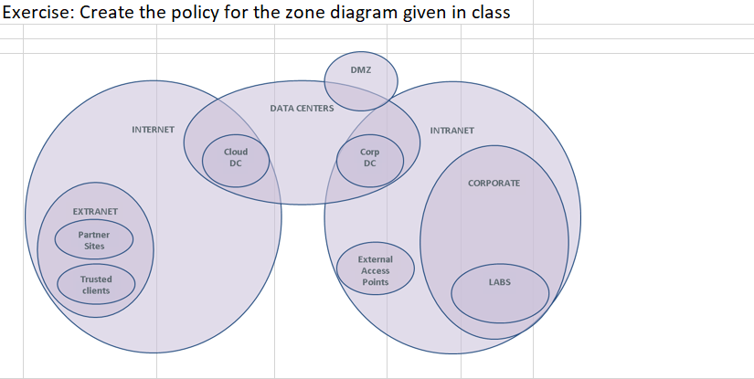
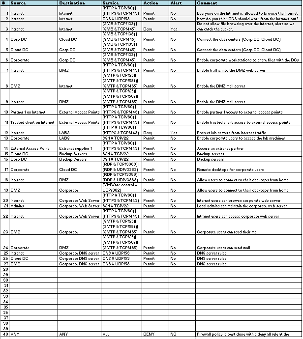

## Week 1 Write Up
This week's write up will focus on the lecture content created by the Director of Threat Intelligence Malware Operations at McAfee Labs. Overall, I found the material to be pretty engaging and interesting. I will go over a little bit about what I learned about malware, why it exists, naming conventions, role of malware researchers, some security definitions I learned, and review aspects of Advanced Persistent Threats (APT's).

#### Why Does Malware Exist?

The primary reason for malware existing spoken upon in lecture generally falls under political/economic gain, defacement/destruction, and reconnaissance/spying. The malware examples spoken about during lecture (sony attack, middle east attacks, etc.) all have adversary profiles with one or more of the primary motivations described above. 

#### Strategy used by Attackers

The lecturer provides one model for attack stategy which involves the following 7 steps:
1.  Reconnaissanc: Discreetly discovering information regarding the target (can be passive or active). One example of this was gathering metadata companies accidentally attach to PDF's which provide valuable information to adversaries.
2. Weaponization: Vector of attack being determined.
3. Delivery: Attack being delivered via emails, USB sticks, trojans, etc.
4. Exploitation: Execuation of the exploit.
5. Installation: Installing the payload.
6. Command and Control: Enables the adversary to do what they need to achieve their task (i.e destroy a system, retrieve information, etc).
7. Actions and Objectives: Execute tasks and objectives.

#### Early Careers in Developing Anti-malware

Careers used to be hard to combe by in computer antivirus research. Commercial anti-virus did not come out to the market until the early 1990's. Up until this point, primary jobs market was to work for the computer antivirus research organization formed in 1990. The market now has over 10 billion invested in the endpoint security market with over a million positions unfilled worldwide.

#### What are the Roles of a Malware Researcher?

The primary role of an malware researcher is to follow best practices, etiquette and safe computing. Futher the researcher should be able to understand a describe the threat, create countermeasures, and approach the design from an anti-attacker perspective. 

#### Basic Malware/Security Definitions:

1. Sample - Piece of malware.
2. Goat - What you ar giving the malware (i.e virtual machines, etc).
3. Bootkits - Master boot record infection. Hidden encrypted disk partition where malware and rootkits are executed. These were popular in the 1980's (malware popularity type comes in waves).
4. Trojan horse - Masquerades as useful software but once installed, often create a backdoor to your computer that gives malicious users access to your system, possible allowing confidential or personal information to be compromised.
5. Spyware - Software that collect personal information without the user’s knowledge or consent for advertorial or fraudulent purposes. 
6. RATS - Remote Aceess Tools System Software.
7. CVE - The Common Vulnerabilities and Exposures (CVE) system provides a reference-method for publicly known information-security vulnerabilities and exposures. 
8. Ransomeware - Software which encrypts users files and will unencrypt them if a user is willing to pay for them.
9. Static Analysis - Performed without the benefit of dynamic execution environment. Pros: Discover what the author intended the code to do, even if that can not be observed in lab environment. Cons: Can be expensive; out of context and external dependencies can not be evaluated.
10. Potentially Unwanted Program (PUP, PUA, PUS) – Adware, spyware, tools.

#### Malware Naming Conventions:
The naming convention is as follows: 
Type:->Platform/->Family->.Varient->!Information
Example: Trojan:Win32/Reveton.T!Ink

This standard format allows for security professionals to used shared terminology that is useful in identifying the malware type, platform its built for, family, its varient, and additional info. Its worth also mentioning this standard is not always followed (but should be more in the future!).

#### Advanced Persistent Threats:

The term advanced persistent threat or APT was created in 2006 by US Air-force analysts. It describes three main aspects of attackers:
Advanced – The attacker is fluent with cyber intrusion methods and administrative techniques, and is capable of crafting custom exploits and related tools.
Persistent – The attacker has an objective (or mission in longer-term campaigns) and works to achieve their goals without detection.
Threat – The attacker is organized, receives instructions, is sufficiently funded to perform their (sometimes extended) operations, and is motivated.

##### Characteristics of an APT:

1. Actors: Terrorists/activists, governments, organized crime groups, competitors, malicious insiders/ex-employee.
2. Motives: Money, disgruntlement/revenge, ideology, or excitement.
3. Targets: Large corporations, governments, defense contractors ... anyone.
4. Goals:
 - Use stealth during intrusion to avoid detection.
 - Create backdoors to allow greater access, especially if other access points have been discovered and patched.
 - Initiating the primary mission: Stealing sensitive data, monitoring communications, disrupting operations, leaving undetected.
 
#### Conclusions

Overall, I found this week to have great content. I am taking this class because I am interested in topics like malware analyis. During the lab I had the opportunity to perform a short malware analysis using FakeNet, ProcMon, Process Explorer, Antispy, and Flypaper. Each of the tools above have different uses. FakeNet is network emulation software to deceive evil.exe to believe it is connected to the internet. ProcMon displays the active file system, thread activity, and registry. Process Explorer displays a view of running processes and allows for further exploration of process details. Antispy identifies the malware (in our case, evil.exe) and dives into files in a system. Flypaper is designed to bar the ending of threads, processes, or memory. In summary, I found the malware makes a copy of itself, creates a schedule for its copy to be run every 30 minutes, alters the hosts file, rummages through system files/directories, attempts to make itself persist in the system, and tries to download an executable from the web on to the infected system. From the information gathered, I believe the malwares identity to be profile RDN/Generic.bfr!0012B0384774 which can be found here: https://home.mcafee.com/virusinfo/virusprofile.aspx?key=2369875#none. I know that I did not find everything, but this was an excellent opportunity for me to fiddle around with some of the tools and try to wrap my head around what it actually means to perform a malware analysis. The lab can be seen on canvas.

## Week 2 Write Up
This weeks write up will focus on the lecture content regarding advanced forensics created by the Director of Threat Intelligence Malware Operations at McAfee Labs. Overall, I found the material to be more interesting than last week. I will go over some notes from the lecture, tools introduced for forensics, and this weeks challenge: Analyzing an image of a USB drive found on a DPRK Defector caught close to the boarder of North and South Korea.

#### What is Forensic Computing?

According to lecture, "forensic computing is the process of identifying, preserving, analyzing and presenting digital evidence in a manner that is legally acceptable” (Rodney McKemmish 1999). Essentially its the processing of discovering data of probative value from information systems using live forensics, post-mortem based forensics, and network based forensics. The four essential principles to be followed while performing computer forensics are to minimize data loss, record everything, analyze the data, and then report the findings. A key take away from the lecturer was to remember that it is not the forensic analysts job to decide if someone is innocent or guilty. It is to simply unearth facts regarding the information systems to aid in the investigation.

#### Incident Response (IC)

The incident response process consists of incident response team preparation, incident detection, initial response, strategy formulation, the investigation (data collection/forensic analysis), and the reporting stage. This can lead to legal action, administrative actions, and remediation (recovering from the incident).

#### The Investigation

The investigation cycle includes creating a timeline analysis (according to the lecturer, this is primarily still done on pen and paper), media analysis, string or byte search, data recovery, and reporting analysis. Physically, the data acquisition consists of gathering memory (virtual/physical), drives or partitions, and network traffic (packet captures). Its important to remember a few things while performing an investigation.
1. You cannot interact with a live system without having some effect on it.
2. Powering down the suspect system can destroy critical evidence.
3. When collecting evidence you should proceed from the volatile to the less volatile.

#### Memory Dumps

The three primary methods to enumerate information in memory dumps are to look for printable strings, reconstruct internal data structures, and search for static signatures of kernel data structures.

Malware related Volatility plugins/tools:
- Malfind: Detects hidden and injected code.
- Csrpslist: Detects hidden processes with crss.exe handles & CsrRoot-Process links.
- Orphan threads: Detects hidden kernel threads.
- PSList: Shows processes based on linked lists.
- PSScan: Shows processes based on the headers found in the “memory pool”.
- ... A few more: svcscan, ldrmodules, impscan, apihooks, idt, gdt, callbacks, driverirp, psxview, ssdt_ex, ssdt_by_threads. 

#### Analyzing the Image of a USB Drive Found on a DPRK Defector (Challenge)

This week involved the challenge of analyzing an image of a USB drive found on a North Korean defector. The following was my process and results of the challenge.

After listening to both clues given, I began with recovering the password to unzip the zipped directory and reveal a .csv file. This consisted of opening “don’t tell mrs Il Ung.jpg” in FileInsight and performing a simple strings analysis.

Using the password found above, I was able unzip and view a .csv file which contained the following targets:
1.  GS Caltex 
- IP: 123.143.8.44 (Target)
2.  S-Oil infra
- IP: 125.135.116.33 (Target)
- IP: 125.135.116.38 (Target)
- IP: 125.135.116.39 (Target)
- IP: 125.135.116.47 (Target)

Next, I changed the bin file to run.exe as there was a hint that this file was the malware. I used a few of the tools from last week to analyze the malware. The FakeNet showed connections were attempted to 43.130.141.XXX (multiple) and 172.21.40.161. ProcMon showed the malware attempting queries from register HKLM\System\CurrentControlSet\services\NetBT\Linkage\Export

After mounting the Image_USB_Mayflower.001, I was able to recover some files using PhotoRec. Here are some of the them:

#### Conclusions

This week has been an interesting look into forensics. I thought the USB analysis challenge was really interesting and a good opportunity to try out different tools from the lectures. FTK imager, FileInsight, and PhotoRec were all useful tools for my analysis. The primary focus of the lectures involved the incident response process, investigation process, and memory dumps. The lectures were particularly intersting coming from someone who has had extensive experience in the field.

## Week 3 Write Up

This weeks write up will focus on the lecture content regarding malware defense. Specifically, the material covered places to detect, block/remove a threat, adversarial attack vectors, and attack graph/flow information. The end of the write up will contain the YARA lab as well as the blog asked for from this week's lecturer (scroll to the bottom of this weeks write up to see this).

#### Key Malware Activities

- First contact (mediums adversaries use to reach their victims): Email, instant messaging, malvertising, poisoned search results, watering hole, physical access.
- Local execution: Established through social engineering, explotation or abusing features.
- Establishing Presence: Blending/hiding in plain sight by appearing to be legitimate (OS-like file names, signed, etc).
- Malicious Activity (information is harvested):
1. Enumerating docs, passwords, processes, etc.
2. Applying a hook via browser, a keylogger, etc.
3. Getting log information.

#### Detect, Block, or Undo Attacks at Each Stage?

- First Contact: 
1. Spam: Anti-spam.
2. Network: Firewall.
3. Network IPS, Web: IP, Domain, and URL reputation.
4. Physical access: Disk encryption.
- Local Execution: 
1. Spam: Client-side content filtering.
2. Network: Network IPS.
3. Web: Content filtering/scanning.
4. Host: Host IPS, Anti-virus, Whitelisting.
- Establish Presence: 
1. Host: Anti-virus.
2. Whitelisting, HIPS.
3. Network: Firewall.
4. Network IPS, Web: IP, Domain, & URL reputation.
- Malicious Activity: 
1. Host: Anti-virus.
2. Network: NIPS, Firewall.
3. Web: IP, Domain, URL rep & content filtering, Data Loss Prevention.

#### Advantages and Disadvantages of Anti-malware Automation

Advantages: Scalable, consistent, and lower performance concern.  
  
Disadvantages: Potential context issue, prone to invasion, and an increase in denial of services attacks and probing.

#### YARA

YARA is the pattern matching Swiss knife for malware researchers. Using YARA, strings can be followed by nocase (case insensitive), wide (strips zeroes in unicode strings), wide ascii (searches both wide and ascii strings), fullword (full delimited strings), Byte patterns (Hexadecimal strings), Accepts “?” and “??” wildcards, or Jumps to denote a number of wildcards.

Inside YARA there is a rule browser (list of previously saved rules), an IDE (where you write code), malware broswer (browse samples to run on), an inspector (shares malware, name, path, size, md5, and sha1 information), and the rules generator (this will find all common strings among samples, but the rules are not very good).

#### YARA Lab

Following the examples given in lecture, I ran the YARA tool on files in 
- C:\Users\Admin\Desktop\malware\Malware Defense\Class1\Sample Group 1\
- C:\Users\Admin\Desktop\malware\Malware Defense\Class1\Sample Group 2\ 
- C:\Users\Admin\Desktop\malware\Malware Defense\Class1\Sample Group 3\ 

From C:\Users\Admin\Desktop\malware\Malware Defense\Class1\Sample Group 1\ I found "AikaQ" and "Jenna Jam" matched to all files in the /sytro directory. This can be seen below:

Following the same process from C:\Users\Admin\Desktop\malware\Malware Defense\Class1\Sample Group 1\, the files in C:\Users\Admin\Desktop\malware\Malware Defense\Class1\Sample Group 2\ matched with "DownloaderActiveX" and the files in C:\Users\Admin\Desktop\malware\Malware Defense\Class1\Sample Group 3\  matched with “TuguuAdw”.

#### Cuckoo 
Cuckoo is an automated malware analysis tool that allows you to understand what a given file does when executed inside an isolated environment. It can bypass sleep bombs by intelligently skipping sleeps, emulate user interaction by moving mouse and pushing buttons, randomize the system clock with each run, and use a randomly named cuckoomon.dll.

An analysis using Cuckoo would look like an isolated vpn with clean environments to run a sample, and a Cuckoo host which is responsable for guest and analysis management of the environments running the samples (the internet/sinkhole). More specifically, it traces win32 API calls performed by all processes spawned by the malware, tracks files being created, deleted and downloaded by the malware during its execution, gets memory dumps of the malware processes, provides network traffic trace in PCAP format, contains screenshots of Windows desktop taken during the execution of the malware, and full memory dumps of the infected machines.

#### Malware Defense BLOG - Chinese Trojan can Steal Passwords and Other Sensitive Information from your Computer -
Author: Garrett Haley  
Saturday, January 26, 2019 (PST)  
MD5 Malware Hash: 068D5B62254DC582F3697847C16710B7  
MD5 YARA Hash:    144de687e53db1eed2be97d749358cdc

While there are an increasing number of malware authors who are using encryption and obfuscation to modify the static contents of malware to thwart security researchers from static-based clustering, there are many instances of malware which are not making the necessary attempts to hide its behavior. This allows researchers to devise systems of identifying such malware. If such malware is not identified, your sensitive personal information may be at risk from malware like the chinese trojan discussed in this article.

#### Origin of Identification

While performing a simple strings analysis on the potential malware, key terms such as "QQLogin.exe","GetTuPian.asp", "DNF.exe", “RegSetValue”, "Keyboard" and many more were discovered. When cross referenced online, there is a strong indication the file may be a trojan that steals passwords and other sensitive information. The trojan can send the information to a remote machine. The file is run-time compressed using UPX. 

To verify that we have indeed identified the malware, more evidence is needed. More strings such as "del%x.bat" and "%x" further incriminate the file as "del%x.bat" is most likely references deleting a batch file which has some sort of name randomization happening which would make the software more difficult for anti-malware programs to detect. Further, during program execution, there is an attempt to add a registry key: HKEY_LOCAL_MACHINE\Software\Microsoft\Windows\CurrentVersion\Run -> c:\qusla.exe. This program performs a lot of registry activities related to the keyboard (RegEnumKey for HKLM\System\CurrentControlSet\Control\Keyboard Layouts, Registry activity for HKCU\Control Panel\Input Method\Hot Keys). This indicates there may be some sort of keylogger involved.

#### How to tell if you are Infected

Based on the activities identified during the original malware identification, I have created a YARA file which can can be seen above to test a file for potential infection. The activities targeted with the YARA file are the strange address referenced containing "GetTuPian", the executables "QQLogin.exe", "DNF.exe", register alterations "RegSetValue" and "Keyboard".

## Week 4 Write Up

This week's write up will focus on the lecture content created by Brad Anton. This consisted of discussing hacking trends, exploits, WinDBG, stack overflows, and heap overflows. Overall, this was my favorite week so far. I thought Brad was pretty entertaining and knowledgeable. I will say it may have been difficult to follow some of what he said if I hadn't taken CS 519 (Cyber Attacks and Defense) last quarter. I thought he did a good job reviewing some of the basics of what I learned from that class as well as add some material.

#### Manipulating Software  

This week began with a discussion about what software manipulation is. Essentially it boils down to finding bugs which alter the behavior of a program in an unintended way which allows for an adversary to take advantage of a misconfiguration or poor programming practices. The example Brian gave was a simple road example. Imagine you are in a program driving a vehicle and there is a choice to turn left or right with an input prompt. What are your choices? Well, the programmer only gave you two choices: left or right. But what if you try going forwards instead? This may lead to a potential path the programmer had not envisioned. On this path, you may find some advantages.

Brad went on to discuss how things have changed in his lifetime. In the past, hacking usually took on less harmful dimensions than what we say today. Website defacement, denial of services attacks were the norm. As we have become more  reliant on the internet and related connected devices, a much higher level of threat sophistication and malice has been achieved by adversaries. Brad briefly discussed cyber armies and bug bounty programs to further show the increase in money and energy now spent in the cyber security domain.

#### Defintions:  

- Memory Corruption: Accessing memory in an invalid way which results in an undefined behavior.
- Exploitation: Taking advantage of a vulnerability. This consists of a vulnerability trigger and payload.
- Vulnerability Trigger: Invokes the software bug to obtain control of the program.
- Payload: Action to be performed when control is obtained. Typtically contains shell code.
- Shell Code: Usually assembly code to execute a shell (e.g. /bin/sh).  

#### WinDBG Introductions 
WinDBG was introduced during the first lecture and a walkthrough challenge was posted (with solutions). We attached WinDBG to a running internet explorer process. We were introduced to the following commands in WinDBG:
 
 - Viewing Memory: dd, da, du
- Breakpoints: bp <addr>
- Clear all: bc *
- Stepping: t, p
- Disassembly: View->Disass.
- Conversion: .formats
- Math: ?1+1
- Modules: lm
Extensions:
- Process (inc heap): !peb
- Thread (inc stack): !teb
- What Addr?: !address 
 
#### Flaw Classes and Vulnerabilities Examples

 Configuration flaw: A service or system which was set up incorrectly. Eg: A weak password.   
 Logic flaw: A service or system containing a design flaw. Eg: softAuthorization issues.  
 Storage flaw: A flaw in protecting system storage. Eg: Inadequate Encryption.  
 Input Validation: A system or service corruption due to a validation flaw. Eg: Memory corruption, injection. 
 
#### Getting Code Execution (Stack)

Step 1: Crash Triage. This consists of discovering what the attacker controls, e.g what registers contain attacker-controlled data, what registers point to attacker-controlled data, is the data on the stack or heap, is the controlled data critical, etc.  
Step 2: Determine the return address offset, e.g how many bytes to the return address.  
Step 3: Position shellcode: provide NOP sleds (0x90's) to code.  
Step 4: Find the address of the shellcode: Use this to overwrite the return address to return to your desired shell code.

#### Getting Code Execution (Heap)

The second lecture focused on performing a heap overflow. A heap overflow is a type of buffer overflow which occures in the heap data area and is different than the stack overflows discussed in the previous lecture. In this structure, memory is dynamically allocated by an application during runtime and contains program data. By controlling an object in the program data it is possible to corrupt the data in a specific way which causes internal structures, e.g, a program function pointer. Brad went over various tools like "Page Heap" which is designed for debugging the heap which can be enabled via gflags to free an object and the !heap WinDbg extension which helps to discover heap information (and more).

#### Conclusions
 
Overall, I enjoyed the material this week. The heap and stack overflow attacks were mostly review for me from CS 519. The tools and some of the vocabulary (ex: crash triage) were new to me. Last summer I had the opportunity to do some penetration testing during an internship. I thought this information was pretty valuable, and directly related to what I will be doing after graduation.

## Week 5 Write Up
 
 This week's write up will focus on the lecture content created by Aditya Kapoor, a research architect at McAfee labs. This week lectures discussed Windows internals and rootkits. Overall, I didn't really enjoy this week's lectures as much as past lectures. The material was good, but I was occasionally lost, and still do not fully understand everyting we went over. In this write up I will go over kernal/user interactions, how kernel memory works, how threads work, how the boot process works, rootkit techniques, and stealth malware trends.

#### Kernel and User Interaction

The application layer (EXE/DLL files) interact with the windows API which interacts with user-mode drivers or the kernel mode. This kernel mode interaction takes place between user-mode drivers and other kernel-mode drivers or exported driver support routines. Once inside  kernel mode, the kernel-mode drivers, exported driver support routines (the operating system kernel), and file system drivers. From the exported driver support routines (the OS kernel) and other kernel-mode drivers can interact with the hardware abstraction layer, which can interact directly with the hardware. 

#### How Kernel Memory Works

Kernel memory is a "flat memory module" which does not contain any security seperation. Therefore, any kernel driver can access any part of the memory. This is composed of the windows kernel (named ntoskrnl.exe) and driver code. Kapoor mentions that many important structures are prime targets for stealth (ex: SSDT, IDT, IRP). 

#### Threads in Windows 

According to lecture, most applications today are multithreaded. The key threading components presented in lecture were the thread stack, thread context, thread environment block, thread scheduling, and thread object. The kernel object is a data structure defined by the OS to describe OS constructs like the thread. Thread context, stack, etc are all defined within the kernel object struct. The following command allows a thread object to be seen in Windbg: KD> dt_KTHREAD. The thread context stores all of the related register values of the thread. Each thread has its own stack. The user mode stack is used for threads function calls and local variables while the kernel stack is used during data transfer between the user to the kernel.

#### System boot process in Windows

The system boot process starts with pre-boot which powers on self test to diagnose memory and hardware components. This loads the bios which finds the boot device and then loads and executes MBR. MBR Then finds the active partition and loads the boot sector in memory to execute it. The boot selector then loads the NTLDR from disk which continues to loads the operating system. Ntoskrl.exe (the kernal) continues to initialize through this process.

#### Process Memory in Windows 

Processes in windows are implemented as objects. Each executable process can contain more than one thread. A process has an object table that handles the other objects which are known to that process. Each process needs one thread to execute.

#### Rootkit Techniques

Inline hooks: HackerDefender, Zbot.  
Import table hooks: Adcliker-BA, Qoolaid.  
DKOM: TDSS.  
Inline hook (Kernel): Apropos.  
IRP hook: TDSS, ZeroAccess.  
SSDT hook: Ntrootkit-K.  
IDT hook: Apropos.  
Sysenter hook: Spam-mailbot.c.  
Filter driver: SearchNet, PigSearch.  
MBR: Mebroot, TDSS.  

#### Stealth Malware Trends

- File forging: Overwrites existing files and create the view in a way that AV gets the clean view instead of the malicious one.  
- Self Protection: Defend components and/or attack security components.    
- Untrusting the Trusted: Threats establish trust on the essential drivers for the system and everything else could be locked out. The AV would now have to find ways to get trusted by malware to get a chance to even load.    
- Removing Dependencies on Files: Scanners based on direct file-system parsers work well so there is no file in the FS which helps rootkits move malicious code to boot process, move malicious code to the bios, or move encrypted malicious code to raw sectors or as a file.  
- Disassociating Memory from File-on-disk: This stems from the difficulty of tracking kernel memory. The rootkits memory can give-away its associated file on disk.  

#### Lab Work
 
 For lab one I examined the Agony rootkit. After running it with Cuckoo, I searched for a .sys file in the analyzer directory and a wininit.sys file showed up. Tuluka showed suspicious API calls which reference this wininit.sys. Using another tool I was able to identify the instructions for NTEnumerateValueKey. For lab two I examined a process before and after the zbot malware was run. The RWX can be seen for the process after the malware was run which is an idicator that the process was indeed infected by the zbot malware. In lab three I again worked with agony. Using WinDBG, I was able to find the offsets of the modified address for the API calls. I then traced the call to the original API address. The NtEnumerateValueKey had an offset of 84,the NtQueryDirectoryFile had an offset of 54, and NtQuerySystemInformation had an offset of 26.

#### Conclusions

Overall, this week was good. I learned some important things about kernal/user interactions, how kernel memory works, how threads work, how the boot process works, rootkit techniques, and stealth malware trends. I also had the opportunity to do some hands on work in the labs. This topic is not necessarily as interesting as digital forensics or penetration testing to me, but I can definitely say that this knowledge is invaluable to both topics. I did feel the most lost this week, but hopefully I will learn more next quarter in CS 444 (Operating Systems II) which will help me to assimilate some of the information presented this week.

## Week 6 Write Up

This week's write up will focus on the lecture content created by Ram Venugopalan and Geoffrey Cooper from the Intel security group. The material had prereading involving IP/UDP/TCP/TLS. This reading was to gain a basic understanding of the protocol functionality and protocol header formats, and the functionality of the protocol and the handshake in TLS. We began this weeks material discussing the Robustness Princple manifesto created by Jonathan Postel which has greatly impacted the philosophy behind networking design for the past 30 years. We then dove into network protection strategies including positive policy, firewalls/security zones, defense in depth, intrusion detection, honeynets/intrusion deception, quarantine, and reputation. Lastely we covered a hodgepodge of network security related topics including man in the middle attacks, covert channels, reconnaissance, spoofing, denial of service/distributed denial of service attacks, backdoors, network address translation, IpSec, advanced evasion techniques, and switch operations. I found this weeks material to be pretty intersting, and much easier to follow than last weeks lectures.

#### Network Security is Needed Because...

From lecture, the fundamental reasons for network security are to keep dangerous hosts/data out to create a "safe space", prevent critical data exfiltration, network resources theft, critical infrastructure destruction, and espionage. Network security can protect hosts with missing internal protections, and find threats out on the network (attacks from in the network). Some such attacks would be a distributed denial of service attack (DDoS), stack overflow, worms, and botnets.

#### Robustness Principle Analysis

#### Network Protection Strategies
#### Positive Policy 

Positive policy defines what is expected to happen in the host. Anything else is not permitted. This gives defenders the advantage of using internal choices which the adversary would have to guess, limits the attack surface, and provides a hook for other trust mechanisms like trust chaining. Using a policy driven domain instead of a threat domain allows for finite enumeration. The drawback to policy is it may be able to detect a threat, but it may not be able to name the threat specifically.  

#### Firewalls / Security Zones

The most common implementation of policy is defining zones in the network with policy between the zones. The software which sits between sectored zones and filter traffic based on set policies is called a firewall. The commonly used zones are internet (Intranet), extranet (corporate), DMZ (user stations). These are best used for describing peer to peer IP policies.  

#### Firewall Exercise

#### Defense in Depth

Simply having layered defenses to improve the overall security posture of the system.  

#### Intrusion Detection

Detects attacks by using signatures and anomly detection. Its advantages are that it can catch known attacks quickly and provide good information on attacks. Its disadvantages are zero day attacks (unknown attacks), and its generation of false positivies.  

#### Honeynets / Intrusion Deception

In the case of an adversary who does not know the proper structure of the network, a phony network can be devised to waste their time and deceive them. This involves applying "sucker algorithms" to slow down the attacker and fake data for them to look at. The issue with this is, it takes a lot of configuration and is often seen less than firewalls and other modes of protection.  

#### Quarantine

This concept is commonly deployed on network entry. It places hosts that misbehave via policy violations, IPS signatures, or by reputation into a quarantine where they cannot infect other hosts. This can be seen implemented in firewalls as a "blacklisting" mechanism, in airport wireless logins, and software defined netowkrs (SDN's).  

#### Reputation

This is a big data solution to network security which collects a list of good and bad things and serves a list of them from the cloud. This could include IP addresses associated with malware/botnets/spammers, URL's that reference pages with scripting attacks, files from known program releases, files that come from known viruses, and many more. This protection mechanism is still susceptable to zero day exploits, stale data, and hosts which are multi-functional. 

#### Man in the Middle Attack

Man in the middle attacks happen when one node wants to send data to another node and the data is intercepted by a third party and stands between the data between both sources, reading and potentially changing the data. This can be done through ARP poisoning where a node floods the network with ARP responses to fool hosts into thinking it is the default gateway, or TCP hijacking which is when an adversary injects, deletes, or changes data into a TCP stream and fixes up packets so no one notices. This can be solved by the hosts picking a shared secret and adding a SHA-256 of each message with the secret, or chain packets using sequence numbers, or just chain the hashes.

#### Covert Channels

Covert channels are channels to transmit information hidden from traditional network control devices which typically have very low bandwidth. Some examples are TCP ISN's, Ack Sequence #, IP ID, and TCP reXmit patterns.

#### Reconnaissance

Active: Adversary wants to attack vulnerable machines on a network. This is to find addresses for services that can be attacked.  
Passive: Adversary is able to see data on the network. This is for the adversary to learn more about people.  

#### Defending Against Reconnaissance

It is difficult to defend against passive reconnaissance except using physical security or cyptography. Active reconnaissance can be defended against by policy/deep inspection, honeynets, log-correlation, SIEM, IPS, and firewall implementations.

#### Spoofing

Spoofing is when an adversary masquerades as another network entity to gain some advantage over the target. TCP sequence numbers, IP addresses, MAC addresses, email addresses, and HTTP fields can all be spoofed.

#### Defending Against Spoofing

Reverse path filtering, ingress filtering dropping packets from routes that should never appear in the Internet routing table, and egress filtering which insures only packets that belong to appropriate internal networks get routed.

#### Denial of Service (DoS)/Distributed Denial of Service (DDoS)

DoS: Involves an adversary consuming resources for an extended period of time such that the targeted service is degraded, some times to a point where it is unusable.  
DDoS = Performs asymmetrical resource utilization which is the key to the success of most DoS attacks. A DDoS attack leverages large numbers of computers to perform resource exhaustion attacks against a target such that it is overwhelmed and unable to perform its function.

#### Defending Against Denial of Service (DoS)/Distributed Denial of Service (DDoS)

Defending against DoS/DDos involves network traffic validation and cleansing by network products. Firewall proxies can validate application protocols to prevent protocol vulnerabilities from exploitation. Ensuring that popular attacks such as SYN Floods, LAND attacks are properly defended against, and traffic scrubbing sensors can help greatly. 

#### Backdoors

Backdoors are intentional threats used to compromise devices (bugs are unintentional).

#### Packet Filtering

Packet filtering is a policy driven whitelisting method to allow only expected traffic thorough the network boundary. This is often the first step toward protecting the network. To filter packets, clear network boundaries and segementation are key to its success. This form of defense uses layer 3 and 4 properties (i.e, addresses and ports) to mandate policy. The drawbacks of packet filtering is its inability to understand higher level applications/protocols. Therefore, it cannot easily shield endpoints from application level attacks.

#### Network Address Translation (NAT)

NAT temporarily maps a connection from a private LAN IP and port to a public IP address and port. This makes it more difficult for attackers to learn the network architecture, and aids in mitigating the low availability of IPv4 addresses.

#### IPSec

IPsec is security at the IP layer which allows IP packets to be encrypted between two nodes. When a network is contructed of IPSec tunnels, it is called a Virtual Private Network (VPN). These are set up by a client using the Internet Key Exchange protocol (which uses a Diffie Hellman public key exchange). Authentication is performed by the shared secret between the client and another node. After the IKE echange, a Security Association (SA) is set up between two two nodes.

#### Advanced Evasion Techniques

Its been shown that even combining multiple evasion techniques at once can fail to notice simple attacks. Sometimes theis can be due to limits in the code, or a faliure to process packets the same way hosts do. AET demonstrates how new vulnerabilities can swiftly affect unpatched machines.

#### How a Switch Works

In normal switches, data is forwarded by the interface hardware based on flow tables and new data is processed by embedded control logic. In an openflow software defined network, existing data is processed by the switch, new data is processed by the openflow controller, and the openflow protocol is used to connect the two.

#### Conclusion

Overall, I thought this material was really great. I learned some important things about network protection strategies, network attack strategies, and network configuration. The firewall exercise was an excellent opportunity to look at how network protection strategies are implemented on a real network, and the lab was a great exercise in network analysis. I am content with what I have learned this week.

## Week 7 Write Up 

This week's write up will focus on the lecture content created by Cedric Cochin from the Intel Security group at McAfee Labs. The topics included web-centric attack vectors, a primer on web user agents, experience with web research tools and attacks, server-side/client-side threat defense, computer crime law in Oregon, and an introduction to advanced research techniques including URL classification. I found this week interesting. I am interested in network and web security, so the last two weeks have been the most interesting to me.

#### Definitions:
- Social engineering: In the context of information security, refers to psychological manipulation of people into performing actions or divulging confidential information. A type of confidence trick for the purpose of information gathering, fraud, or system access, it differs from a traditional "con" in that it is often one of many steps in a more complex fraud scheme.    
- Phishing: The fraudulent practice of convincing individuals to act counter to what is beneficial for them through fake authority, blackmail or other forms of manipulation to gain data, access to a system/network, money or other forms of property.   
- SEO Poisoning: Use trending information on the interent to lure victims to malicious content via redirection.  
- Fake Updates: Malware which mimics well-known sofware to convince users with good intentions to do something harmul.  
- Social media: Using social media authority to trick/redirect users to malicious activity.
- Malvertising: Attacker using advertising networks as delivery mechanism for malware.
- Waterhole attacks: Attacks target a common resource used by the individuals they wish to target as a delivery mechansim for malware.
- Man-in-the-middle attacks: Interception and potential modification of traffic between nodes.
- Man-in-the-browser attacks: Interception and modification of traffic to/from the server, but inside the browser.
- DNS Spoofing: ISP DNS server returns malicious IP from a cache was poisoned by an attacker to redirect a user to the incorrect location.
- Clickjacking: Tricking the user into clicking a pre-determined link in a rendered HTML page by hiding malicious content behind legitimate content.
- SQL Injection: Attacker directly communicates GET/POST requests in a manner unintended by the creators to circumvent authentication/authorization or reveal private data.
- Cross-Site-Scripting (XSS): Inject client-side script into other user’s browsers to bypass SOP rules to allow for script execution to perform malicious activity.
- Cross-Site-Request-Forgery (CSRF): Exploit users trust in a trusted identity to trick the users browser into sending requests to the target site.
- MAEC: Malware Attribute Enumeration and Characterization
- Cybox: Cyber Observable eXpression
- Stix: Structured Threat Information eXpression
- CAPEC: Common Attack Pattern Enumeration and Classification

#### Oregon Law: Computer Crime

There are three main categories of computer crime:
1. Knowingly accessing or using a computer/network for fraudulent purposes to obtain money, services, property, or proprietary information (or attempting to).    
2. Knowingly altering, destorying, or damaging any computer, network, software, dada, etc (or attempting to).   
3. Knowingly accessing computer or network without authorization (or attempting to).  
- Category 1 and 2 offenses are charged as a class C felony, and the 3rd category is charged as a class A misdemeanor. Conviction could lead to as much as one year for a class A misdemeanor, and up to five years for a class C felony.  

#### Historic Evolution of Web-Based Malware Delivery.

Stone Age (1994-2000): Consisted of generic phishing attacks, popup-based redirection, and script bombing.  
Bronze Age(2000-2005): Improved upon existing phishing attacks, cross-site scripting and browser exploits enter.  
Iron Age (2005-2015): Improved upon browser exploitation, Spear phishing and plug-in exploits enter.  
Today - Beyond (2015-): Improved upon spear phishing attacks, MitB and HTML5 attacks enter.  
***95% of all malware are delivered via web attacks! ***

#### Injection Points of Web-based Attacks

Injection points include browser/extensions, the script engine, WinInet ETW/ETL, and the HTTP proxy network layers (i.e, HTTP, HTML, Javascript, and de-obfuscated content).

#### User-level Attacks  

According to the lecture, people are the weak link in a network. Hardening the current browser/OS will not be able help with this fundamental problem. Users are often exploited via social engineering, SEO poisoning, fake updates, social media, malvertising, and waterhole attacks (see definitions above). Some common user traits often exploited include impulsiveness, laziness, arrogance, and an overly clickable nature. 

#### Common Defenses to User-level Attacks

Some fundamental defenses include URL/domain reputation systems, site certification services, client and gateway AV/AM, safe URL shorteners, content provider education, and end user education (this is the haredest one, coined "the human firewall" in lecture).

#### Browser/Network Stack -level Attacks

Attack surface includes Mitm, DNS hijacking, form manipulation, iframe injection, browser/script engine exploit (HTML5, DLL injection, man in the broser, XSS/XFS/CSRF/XSHM, page hijacking, clickjacking), or third party exploits (Java, Adobe Reader, Adobe Flash, QuickTime, etc). See definitions above.

#### Modern Web Broswer Security Features

Modern brosers use content security policy enforcement (CSPE), URL scheme access rules, OS isolation tehniques (i.e, sandboxing, etc), redirection restrictions, content sniffing, disruptive script handling, URL reputation client, and AV/AM content monitoring.

#### New Security Risks of HTML5

In lecture the main security risks discussed were the following:  
1. New APIs potential lack of security could cause increased security defects in Apps and websites.  
2. Apps provided outside of app store certification programs directly by vendors (malware finding its way into existing app stores).  
3. Possibility of introduced exploits in the media stream due defects.  
4. Increased sharing allowing possible misuse compromising security.  

#### Web Malware Tool-box
1. Alexa: Tool which collects data through end-user toolbars which is useful in determining general site popularity and prevalence.  
2. IPVoid: Tool which checks URL's a large list IP blacklists (35+ blacklists).  
3. CheckShortURL: URL Expander Service for most short URL services.
4. Site Dossier: General Site information tool.
5. Webutation: URL Reputation tool which utilizes Google Safebrowse, Norton Safeweb, WebAV, and Web of Trust.
6. Web inspector: Web scanning tool which also provides a list of recently detected malicious sites.
7. Virus Total: Online web scanning tool which also provides a list of malware files.
8. Linux JWHOIS: Domain registration data client.
9: Linux Dig: DNS resolver utility tool.
10: PhantomJS: Headless, scriptable browser.
11: Burp Suite: Graphical deconstruction tool.
12: Web Scarab: Graphical deconstruction tool.
13: Firebug: Multi-feature Firefox plugin.

#### Host/Lexical Url Classification

Host/lexical url classification is used to identify malicious url's based on human-authored rules, machine learning, or in a complementory method. This is to classify malicious content before its served. This is to protect against short-lived malware, auto-cloaking malware, single-shot malware, or when web crawling is computationally infeasible.

#### Conclusion

Another good week of material. Some of the material was repeated from past lectures, but it wasn't overly distracting. It was interesting to learn about Oregons computer crime laws, injection points for web-based attacks, new and upcoming vulnerabilities due to HTML5, tools from the "web malware toolbox", and browser security features. I also enjoyed the "Host/Lexical URL Reputation Bake-off" assignment. I decided to use a machine learning algorithm (naive bayes) to classify malicious URL's. Overall, I am enjoying the topics and materials presented this week.

## Week 8 Write Up 

This week's write up will focus on the lecture content regarding social engineering and introductory data manipulation created by Eric Peterson, a research manager from McAfee. The topics he covered included terminology, history, technology, tools, research, and techniques. I thought the lecturer was pretty good, but I am not very interested in topics. The labs were somewhat interesting, but I found the interesting material very similair to previous weeks.

#### Terminology Discussed in Lecture

Spam/Ham: Ham is email that is not spam while spam is unsolicited email messages sent in bulk email (this is also known as "junk mail").      
Spamtrap/Honeypot: A spamtrap is a honeypot used to collect spam. A honeypot is a mechanism set to draw in an adversary to detect, deflect or counteract attempts at unauthorized use of systems.    

Botnet: A botnet is a number fo internet connected devices which have been infected by an adversary. The adversary can use these devices to perform distributed denial of service attacks (DDoS), steal user information, send span, and allow the attacker to access the devices, and potentially its connections.  

Snowshoe Spam: Essentially, unsolicited bulk emailing which spreads across a large area briefly, and only once.  

Phishing vs Spear Phishing: Phishing is the practice of sending emails claiming to be from reputable companies in order to induce individuals to reveal personal information, such as passwords and credit card numbers. Spear phishing is an email scam targeted towards a specific individual, organization or business.  

Heuristics: A method to detect previously unknown computer viruses and new variants of viruses already in the "wild" used by many computer antivirus programs.  

Bayesian: A method of statistical inference in which the Bayes theorem is used to update the probability for a hypothesis (great for predictive classification problems).  

Fingerprinting/Hashing: From a security perspective, both fingerprinting and hashing can be used to aid in the identification process due to the difficulty of replicating or decoding the data.  

#### History

During lecture we discussed some classical examples of phishing including "419 phishing", "Canadian pharmacy phishing", and the "Pump'n'Dump". A graph on botnet prevalence was shown of the last decade. There were large uptakes during 2010 then a drop from 2011 - 2013. Since 2013, there has been a positive increasing trend of botnets (becoming more prevalent again). 

#### Technology

Spam engines can be reputation driven, IP driven, message driven, and/or URL driven. The engine may use varixed strings/variable strings (regular expression), message atrtribues, or a combination of both (meta rules).

#### Tools

- DIG: Domain information groper – investigation of DNS records.
- WHOIS: Searching for IP/Domain registration information.
- Grep/SED/AWK: data parsing and manipulation Open-source databases.
- PostgreSQL: “The world's most advanced open source database” (according to lecture).
- MySQL: “The world's most popular open source database" (according to lecture).
- The Regex Coach: Regular Expression syntax/functionality learning aid.
- Trustedsource.org: Historical & current reputations based on McAfee data.
- Spamhaus.org: Accepted authoritative source of reputation data.

During the lab, the Regex coach was very useful but also a little bit difficult to learn. Regexes are developed similair to the Yara signatures we used in earlier labs (including this week to compare strings from incoming emails to seperate the ham from the spam. The emphasis to gaining accuracy was to improve the regexes because the different between 98% and 99% is very large when on a large scale (i.e, the internet). There were two primary methods mentioned for analyzing emails: probability scoring and additive scoring. Additive scoring is developing a point threshold for whether an email should be classified as spam and then adjust the points based on various factors disovered about the email. Probability scoring (what I used last week for my URL classifier) is idenitifying the programs confidence on whether something is spam based on various indentified parameters.
 
#### Research Technique Considerations 

Research technique considerations include identifying how much user input is required, what quality assurances are expected, the value of human input vs automating it, resource cost, fault tolerance, probability scoring/additive scoring, and combination considerations of automation and human input. Below are some basic research techniques discussed in lecture:    

- Parsing: Extraction of key meta data.
- Grouping: Group data by timestamp from other common elements.  
- Aggregation: Values/time, Count distinct, etc (Exposure of relevant research paths).  
- Identifying outliers (example from lecture): When A, which is highly similar to B, is classified as spam but B is not.  

#### Data Scientific Method (Presented day 2 of Lecture)

1. Start with data.  
2. Develop intuitions about the data and the questions it can answer.  
3. Formulate your question.  
4.Leverage your current data to better understand if it is the right question to ask. If not, iterate until you have a testable hypothesis.  
5. Create a framework where you can run tests/experiments.  
6. Analyze the results to draw insights about the question.

#### Conclusion

This week was not as interesting as past weeks as it was slightly more narrow, and the topic did not necessarily capture my attention. The key takeaways were that many aspects of security can be reduced to finding the largest commonalities between large data sets, classification accuracy is directly tied to the depth of samples provided, spam is more pervasive than one may think, and education is key to preventing social engineering/introductory data manipulation attacks from succeeding. Also more generally, the lecturer wanted to describe the process of sepearting "the spam from the ham", its efficiency, and why the design of filters allows for some spam to find its way to a users inbox. This essentially comes a design decision. The filter is designed to keep annoying and potentially dangerous emails out of sight, but should not cost the customer the interactions they expect from the service (potential money/time/relationship losses).

 

